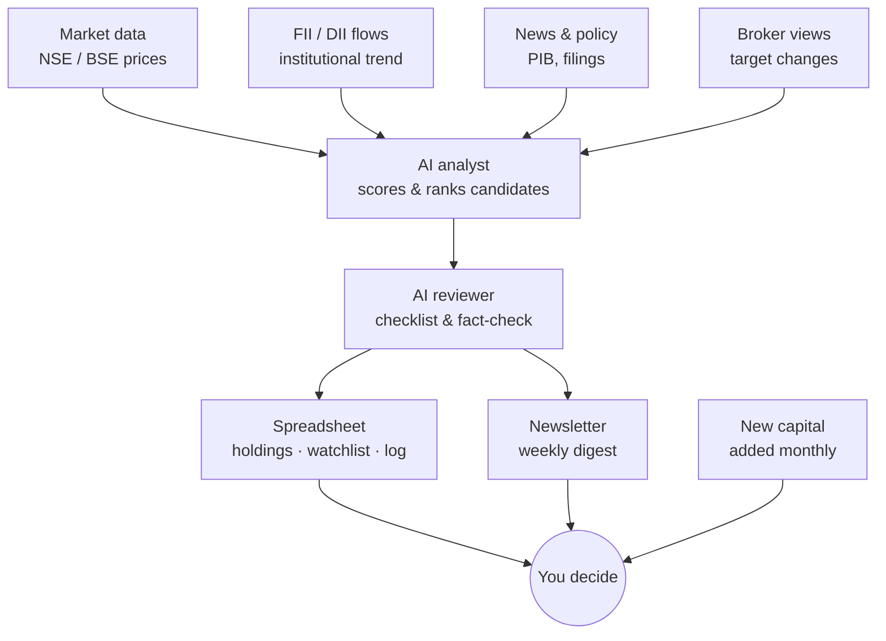

<div align="center">

# 📊 Portfolio AI Pipeline

**A dual-AI research system for long-term Indian equity investing.**
Data engineering meets applied AI — market data, institutional flows, and news
distilled into a weekly, human-approved recommendation digest.


</div>

---

## 🧭 Overview

This project is a personal research pipeline that:

1. Pulls market prices, FII/DII institutional flow data, news, policy filings,
   and broker research for a watchlist of Indian equities.
2. Feeds that data to an **AI analyst** that scores and ranks candidates
   against a defined long-term thesis.
3. Sends the draft to an **AI reviewer** that checks it against a fact/logic
   checklist before anything reaches a human.
4. Publishes a **weekly newsletter** and updates a tracked **spreadsheet**
   (holdings, watchlist, decision log).
5. Leaves every buy / sell / hold decision to the human in the loop —
   the system recommends, it never trades automatically.

> ⚠️ **This is a personal research and learning project, not financial advice.**
> Nothing here executes trades or guarantees returns. See [Disclaimer](#-disclaimer).

---

## 🏗️ Architecture



---

## 📁 Repo structure

```
portfolio-ai-pipeline/
├── scripts/              # Data ingestion (market, FII/DII, news)
├── ai/                   # Analyst prompt + reviewer checklist
├── sheets/               # Portfolio tracker templates (CSV)
├── newsletter/           # Newsletter template + generator
├── data/                 # Cached pulls (gitignored)
├── .github/workflows/    # Scheduled pipeline (GitHub Actions)
├── requirements.txt
└── README.md
```

---

## 🛠️ Tech stack

| Layer            | Tool                                   | Cost        |
|-------------------|-----------------------------------------|-------------|
| Market data       | `yfinance`, NSE bhavcopy                | Free        |
| Institutional data | NSE FII/DII reports                    | Free        |
| News & policy      | Google News RSS, NewsAPI free tier, PIB | Free        |
| AI analyst/reviewer| Claude API (or free-tier LLM)           | ~₹0–500/mo  |
| Scheduling         | GitHub Actions (free tier)              | Free        |
| Tracking           | Google Sheets / CSV                     | Free        |
| Delivery           | Telegram bot / Gmail SMTP               | Free        |

---

## 🗺️ Roadmap

- [x] Define architecture & data sources
- [x] Spreadsheet schema (holdings / watchlist / log)
- [ ] Market + FII/DII data ingestion scripts
- [ ] News & policy scraper
- [ ] AI analyst prompt (scoring & ranking logic)
- [ ] AI reviewer checklist
- [ ] Newsletter template + generator
- [ ] GitHub Actions weekly schedule
- [ ] Broker-consensus cross-check

---

## 🚀 Getting started

```bash
git clone https://github.com/<your-username>/portfolio-ai-pipeline.git
cd portfolio-ai-pipeline
pip install -r requirements.txt
cp sheets/holdings_template.csv sheets/holdings.csv
```

Edit `sheets/holdings.csv` with your current positions, thesis, and stop-loss
levels, then see [`ai/analyst_prompt.md`](ai/analyst_prompt.md) for how
recommendations are generated.

---

## ⚠️ Disclaimer

This repository is a personal, educational project combining data engineering
and applied AI. It is **not** financial advice, and nothing in this repo
should be treated as a recommendation to buy or sell any security. All
investment decisions and their outcomes are the sole responsibility of the
person using it.

---

<div align="center">
<sub>Built as a learning project — data engineering × applied AI × long-term investing.</sub>
</div>
